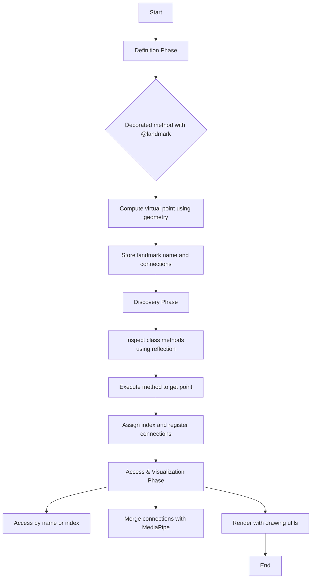

# How It Works

The virtual landmark system operates in **three core phases**, designed to integrate seamlessly with MediaPipe’s architecture while enabling the addition of custom points and connections.

---

## 1. Definition Phase

In this phase, developers define new landmarks by implementing methods decorated with `@landmark`. Each method contains the geometric logic required to compute a virtual point, typically derived from existing MediaPipe landmarks (e.g., computing the midpoint between the shoulders to get the neck).

**Example:**

```python
@landmark("NECK", connection=["LEFT_SHOULDER", "RIGHT_SHOULDER"])
def _neck(self):
    return calc.middle(self.LEFT_SHOULDER, self.RIGHT_SHOULDER)
```

The `connection` parameter defines topological links to existing points, which are later used for visualization.

---

## 2. Discovery Phase

When an instance of `VirtualLandmark` is created, it automatically scans for decorated methods using Python reflection. For each detected method:

- The method is executed to compute the landmark’s position.
- The resulting point is added to the internal list of landmarks with an assigned index.
- Any defined `connection`s are registered to form new edges between landmarks.

This automatic process is encapsulated within the method `_process_virtual_landmarks()`.

---

## 3. Access & Visualization Phase

Once the virtual landmarks are computed, they can be accessed and visualized just like MediaPipe's built-in landmarks:

- **By index:**  
  `landmarks[custom.NECK.value]`

- **By name:**  
  `custom.NECK` returns a `VirtualPoseLandmark` object containing metadata and index.

- **For rendering:**  
  Custom connections are merged with `mp.solutions.pose.POSE_CONNECTIONS`, enabling unified visualization with MediaPipe’s drawing utilities.

The system remains fully compatible with `NormalizedLandmarkList` and downstream MediaPipe components, making it easy to integrate into existing pipelines.

---

## Diagram: Virtual Landmark System Workflow



---
