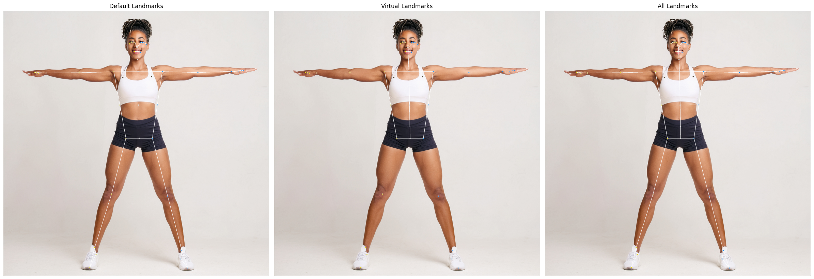

# Virtual Landmark
{: .fs-9 }

Extend [MediaPipe Pose](https://google.github.io/mediapipe/solutions/pose.html) enabling virtual landmarks through geometrically calculated 3D points and their edges
{: .fs-6 .fw-300 }

[Get started now](#getting-started){: .btn .btn-primary .fs-5 .mb-4 .mb-md-0 .mr-2 }
[View it on GitHub](https://github.com/cvpose/virtual_landmark_python){: .btn .fs-5 .mb-4 .mb-md-0 }

---

The `virtual-landmark` lib enables the dynamic generation of new pose landmarks derived from geometric relationships within the human body. These virtual points are seamlessly integrated into the existing MediaPipe pose structure, allowing developers to expand the landmark topology without altering the base model. This integration supports both spatial reasoning and high-level abstraction by embedding custom points—such as midpoints, projections, or anatomical estimates—directly into the landmark list.

In addition to structural expansion, the library provides an intuitive interface for accessing both original and extended landmarks by name, promoting clarity and consistency in code. These landmarks are fully compatible with MediaPipe’s native rendering tools and export workflows, allowing for immediate visualization and deployment. Furthermore, the framework supports the development of modular, pose-driven logic through a clean, extensible API that encourages reuse, experimentation, and integration with machine learning pipelines.

The visual comparison below demonstrates the evolution from the default MediaPipe landmarks to an enriched virtual structure. The left image shows the standard pose connections, the center highlights custom virtual landmarks defined using this system, and the right image presents the combined result with both native and extended landmarks rendered together for full-body analysis.

---

## About the Project

**virtual-landmark** is © 2024 by the [cvpose team](https://github.com/cvpose), and provides a framework for defining and integrating virtual pose landmarks into the MediaPipe pipeline.

This library was created to support pose-driven applications in martial arts, fitness, and education, where anatomical extensions and pose analysis are required beyond the default landmark set.

### License

This project is licensed under the [Apache 2.0 License](https://github.com/cvpose/virtual_landmark_python/blob/main/LICENSE).

### Contributing

We welcome contributions! If you'd like to suggest improvements, bug fixes, or new features, please open an issue or submit a pull request.

Read more about contributing on [our GitHub repository](https://github.com/cvpose/virtual_landmark_python#contributing).

### Code of Conduct

We are committed to fostering a welcoming, respectful, and inclusive environment.

[View our Code of Conduct](https://github.com/cvpose/virtual_landmark_python/blob/main/CODE_OF_CONDUCT.md) on GitHub.
