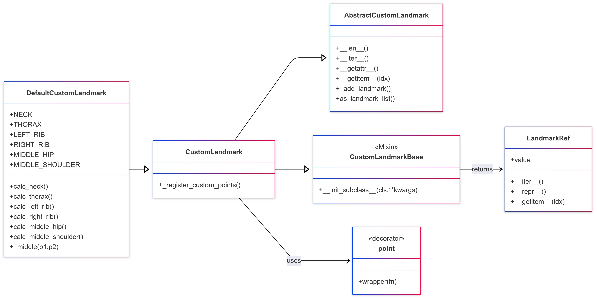

# Architectural Overview

This document describes the architecture of the custom landmark extension system built around MediaPipe pose landmarks. It is designed to provide extensibility, modularity, and ease of integration for virtual landmark definitions.

## How It Works

The virtual landmark system operates in three core phases:

### 1. **Definition Phase**
Developers define virtual landmarks by creating methods decorated with `@landmark`. These methods contain geometric logic to compute a 3D point, often based on existing landmarks (e.g., the midpoint between shoulders).

Example:
```python
@landmark("NECK", connection=["LEFT_SHOULDER", "RIGHT_SHOULDER"])
def _neck(self):
    return calc.middle(self.LEFT_SHOULDER, self.RIGHT_SHOULDER)
```

### 2. **Discovery Phase**
When an instance of `VirtualLandmark` is created, it introspects all methods using Python’s reflection to find those decorated with `@landmark`. For each one:

- It calls the method to compute the landmark point.
- It assigns the new point an index in the landmark list.
- It registers connections (topological edges) based on the `connection` argument.

This happens automatically in `_process_virtual_landmarks()`.

### 3. **Access & Visualization Phase**
After processing, virtual landmarks can be accessed similarly to built-in MediaPipe landmarks:

- By index: `landmarks[custom.NECK.value]`
- By name: `custom.NECK` returns a `VirtualPoseLandmark` object.
- For visualization, connections are merged with MediaPipe’s default edges to enable seamless drawing.

The system is fully compatible with MediaPipe’s rendering, `NormalizedLandmarkList`, and downstream models.

---

## Project Structure

```bash
virtual_landmark
├── abstract_landmark.py           # Core landmark storage logic
├── calculus.py                    # Math utilities for landmark generation
├── decorator.py                   # @landmark decorator
├── drawing_utils
│   ├── connections.py             # Connection definitions
│   └── style.py                   # Pose styling for visualization
├── virtual_landmark.py            # Execution logic for virtual landmarks
└── virtual_pose_landmark.py       # Dynamic index-based access system
```

---

## Class Diagram



---

## Components

### 1. `abstract_landmark.py`

**Class:** `AbstractLandmark`

#### Purpose:
Base class responsible for managing and storing both original and virtual landmarks, providing iterable access and landmark list conversion.

#### Responsibilities:
- Index-based and iterable access to landmarks.
- Addition of virtual landmarks via `_add_landmark`.
- Connection definition support via `_add_connection`.
- Export to `NormalizedLandmarkList`.

#### Key Methods:
- `__getitem__`, `__iter__`, `__len__`
- `_add_landmark(name, point)`
- `_add_connection(name, targets)`
- `as_landmark_list()`

---

### 2. `virtual_landmark.py`

**Class:** `VirtualLandmark`

#### Purpose:
Concrete implementation that detects and executes all `@landmark`-decorated methods.

#### Inherits:
- `AbstractLandmark`

#### Responsibilities:
- Scans and processes decorated methods.
- Registers virtual landmarks and their connections dynamically.
- Exposes `virtual_landmark` accessor object for consistent indexing.

#### Key Method:
- `_process_virtual_landmarks()`

---

### 3. `decorator.py`

**Function:** `@landmark(name, connection=[])`

#### Purpose:
Decorator that registers a method as a virtual landmark generator.

#### What it does:
- Tags the method with `_landmark_name` and `_landmark_connections`.
- Enables later introspection by `VirtualLandmark`.

#### Example:
```python
@landmark("NECK", connection=["LEFT_SHOULDER", "RIGHT_SHOULDER"])
def _neck(self):
    return calc.middle(self.LEFT_SHOULDER, self.RIGHT_SHOULDER)
```

---

### 4. `virtual_pose_landmark.py`

**Class:** `VirtualPoseLandmark`

#### Purpose:
Enum-like interface for accessing all original and custom landmark indices by name.

#### Responsibilities:
- `add(name, index)` registers new landmarks.
- Supports access via `.NAME`, `["NAME"]`, and `.NAME.value`.

#### Key Methods:
- `__getitem__`, `__getattr__`, `__contains__`, `add()`

---

### 5. `calculus.py`

**Module:** `calculus`

#### Purpose:
Contains reusable geometric computations used in virtual landmark generation.

#### Functions:
- `middle(p1, p2)`
- `centroid(*points)`
- `projection(p1, p2, target)`
- `extend(p1, p2, factor)`
- `normalize(p1, p2)`
- `rotate(p, axis_p1, axis_p2, angle)`
- ...and others

---

### 6. `drawing_utils/connections.py`

**Class:** `Connections`

#### Constants:
- `CUSTOM_CONNECTION`
- `POSE_CONNECTIONS`
- `ALL_CONNECTIONS`

#### Purpose:
Combines default MediaPipe and custom connections for use in visualization.

---

### 7. `drawing_utils/style.py`

**Class:** `Style`

#### Method:
- `get_extended_pose_landmarks_style(landmarks)`

#### Purpose:
Returns drawing styles for default and custom landmarks.

---

## Summary

| Component                  | Role                                               | Description                                             |
|---------------------------|----------------------------------------------------|---------------------------------------------------------|
| `AbstractLandmark`        | Core storage of landmark data                      | Foundation for all landmark-based access                |
| `VirtualLandmark`         | Executes virtual landmark logic                    | Detects and registers `@landmark`-decorated methods     |
| `@landmark` Decorator     | Declares landmark methods                          | Connects user-defined logic to system internals         |
| `VirtualPoseLandmark`     | Named access to all landmark indices               | Mimics `PoseLandmark.LEFT_SHOULDER.value` access        |
| `calculus.py`             | Reusable geometry utilities                        | Used by virtual landmarks for spatial computation       |
| `Connections`             | Unified landmark connection list                   | Includes default + custom edges                         |
| `Style`                   | Pose rendering style                               | Custom style mapping for landmarks                      |
