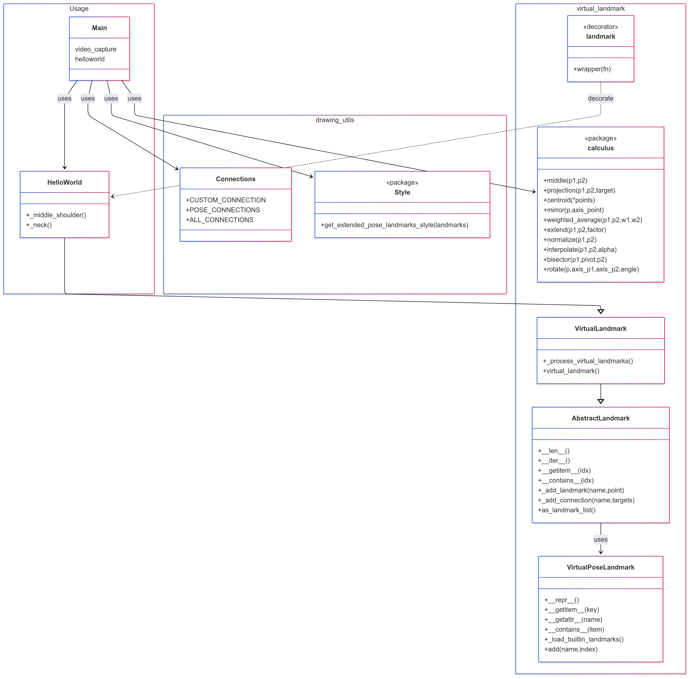

# Architectural Overview

This document describes the architecture of the custom landmark extension system built around MediaPipe pose landmarks. It is designed to provide extensibility, modularity, and ease of integration for virtual landmark definitions.

## Project Structure

```
src/
├── custom_landmarks/
│   ├── abstract_custom_landmark.py
│   ├── custom_landmark_base.py
│   ├── custom_landmark.py
│   ├── default_custom_landmark.py
│   ├── decorator.py
│   └── landmark_ref.py
```

---

## Class Diagram



---

## Components

### 1. `abstract_custom_landmark.py`

**Class:** `AbstractCustomLandmark`

#### Purpose:
Provides the foundation for working with MediaPipe landmarks and extending them with virtual (custom) landmarks. It encapsulates the base behavior of storing and managing landmarks.

#### Responsibilities:
- Stores the original MediaPipe landmarks.
- Adds new landmarks using `_add_landmark`.
- Provides full support for:
  - Iteration
  - Indexing
  - Conversion to `NormalizedLandmarkList`

#### Key Methods:
- `add_landmark(point)`: Adds a new 3D point to the list and returns its index.
- `as_landmark_list()`: Returns the complete landmark list in MediaPipe format.

#### Idea:
This class isolates all logic that deals directly with the MediaPipe landmark structure, allowing upper layers to focus on customization logic.

---

### 2. `custom_landmark_base.py`

**Class:** `CustomLandmarkBase`

#### Purpose:
Provides dynamic registration of landmark properties defined via the `@point` decorator. It defines how decorated methods are converted into runtime-accessible properties.

#### Responsibilities:
- Detects decorated methods via `__init_subclass__`.
- Dynamically adds:
  - `.NAME` → returns `LandmarkRef` (3D point)
  - `.NAME.value` → index of the point

#### Notes:
- Uses a helper class `LandmarkRef` to expose landmark data and index elegantly.
- Automatically integrates decorated methods into the API interface.

#### Idea:
`CustomLandmarkBase` takes care of the **dynamic interface generation**. It enables classes to declare points declaratively using decorators, abstracting away property logic entirely.

---

### 3. `custom_landmark.py`

**Class:** `CustomLandmark`

#### Purpose:
Combines landmark extension and dynamic registration into a single concrete implementation. This is the class that should be extended by users.

#### Inherits:
- `AbstractCustomLandmark` (landmark storage logic)
- `CustomLandmarkBase` (property interface logic)

#### Responsibilities:
- Executes methods decorated with `@point(...)`.
- Computes and registers custom landmarks.
- Stores internal maps:
  - `_custom_points[name]` → (x, y, z)
  - `_custom_points_index[name]` → index

#### Key Method:
- `_register_custom_points()`: Automatically runs all decorated landmark generators.

#### Idea:
`CustomLandmark` is the **execution layer** that handles the runtime instantiation, computation, and insertion of the virtual landmarks into the landmark list. It bridges the base storage with the dynamic interface.

---

### 4. `decorator.py`

**Function:** `point(name: str)`

#### Purpose:
Decorator used to mark methods as virtual landmark generators.

#### What it does:
- Attaches metadata (`_is_custom_landmark`, `_landmark_name`) to the method.
- Used by `CustomLandmarkBase` during subclass creation.

#### Idea:
Provides a declarative and elegant syntax for defining virtual landmarks. Keeps the point registration logic readable and maintainable.

---

### 5. `landmark_ref.py`

**Class:** `LandmarkRef`

#### Purpose:
Wrapper for a single virtual landmark.

#### Provides:
- `.value` → index in the landmark list
- Iterable and indexable as `(x, y, z)`
- Clean `repr` for debugging and logging

#### Example:
```python
lm.LEFT_RIB         # returns LandmarkRef → behaves like (x, y, z)
lm.LEFT_RIB.value   # returns index
```

#### Idea:
Unifies access to the landmark coordinates and their index using a single object, matching the design pattern of MediaPipe's `PoseLandmark.LEFT_SHOULDER.value`.

---

## Summary

| Component                  | Role                                               | Conceptual Responsibility                            |
|---------------------------|----------------------------------------------------|-------------------------------------------------------|
| `AbstractCustomLandmark`  | Manages core landmark list logic                  | Encapsula a estrutura e operações de base do landmark |
| `CustomLandmarkBase`      | Dynamically registers properties via `@point`     | Cuida da interface dinâmica declarativa               |
| `CustomLandmark`          | Computes and registers custom landmarks           | Instancia e executa os pontos customizados  |
| `@point` Decorator        | Declares a method as a virtual landmark generator | Marca declarativamente pontos virtuais                |
| `LandmarkRef`             | Access point value and index in unified interface | Interface acessível tipo MediaPipe                    |

---
